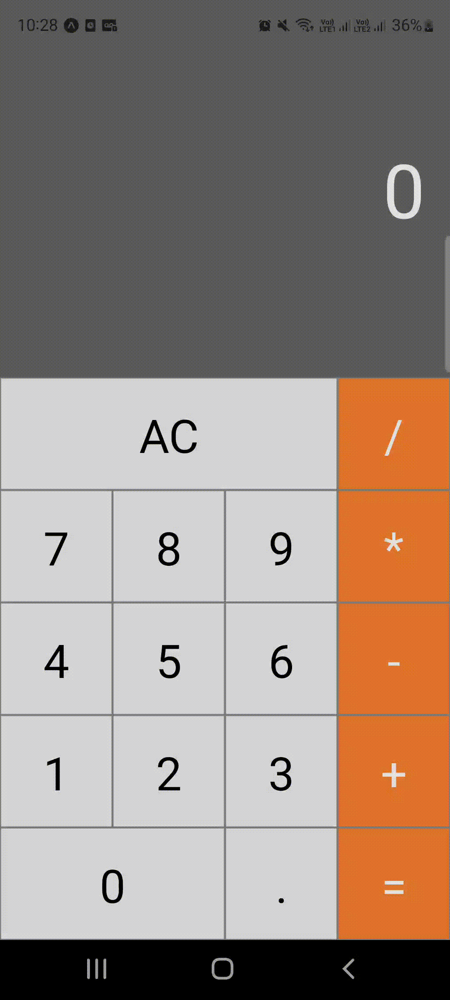

<h1> Calculator Project in </h1>
<p> Project created to study react native, MAC calculator. </p>

image of the application running <br>


 
<br><br>



## Calculator in React and Expo

Introduction

This project consists of developing a calculator using React and Expo. The main goal was to improve front-end development skills and better understand how mobile applications work using the Expo framework.

Motivation

The decision to develop a calculator came from the desire to practice fundamental React concepts, such as state, props and functional components, in addition to exploring the Expo environment for building mobile applications.

Learnings

During the development of this project, several important pieces of knowledge were acquired, including:

1. State Manipulation

Using the useState hook to manage the state of inserted values ​​and the result of operations.

Updating state asynchronously and its implications on the application flow.

2. Componentization

Creating reusable components for calculator buttons and display.

Organizing the code to maintain readability and modularity.

3. Styling

Using React Native's StyleSheet to style components.

Adapting the layout to different screen sizes, ensuring responsiveness.

4. Calculation Logic

Implementation of basic mathematical operations (addition, subtraction, multiplication and division).

Handling errors, such as division by zero and invalid data input.

5. Integration with Expo

Understanding the development and testing flow with Expo Go.

Using Expo tools to facilitate debugging and iterative development.

Challenges Encountered

Managing state in chained operations.

Ensuring responsiveness on different devices.

Conclusion

The development of this calculator provided a better understanding of the fundamentals of React and the Expo environment. It was possible to reinforce skills in componentization, state management and styling, in addition to facing challenges that reflect real problems in the development of mobile applications.

This project serves as a basis for future more complex work and highlights the importance of organizational practices and writing clean and reusable code.


_When downloading the files you will have to run the command._

```sh
cd calculator
npx expo
```
_requirements:_ <br>
**Node installed**


## Documentation

To explore the updated documentation.

_To access the React Native documentation, usage [React Native](https://reactnative.dev/docs/environment-setup)._ <br>
_To access the NodeJS documentation, usage [NodeJS](https://nodejs.org/pt)._ <br>
_To access the Expo documentation, usage [Expo](https://expo.dev)._

## Meta

Your Name – [@7hallis](https://x.com/7hallis) – thallisffc@gmail.com

Distributed under the 7hallis license. See `LICENSE` for more information.

[https://github.com/7hallis](https://github.com/7hallis)
